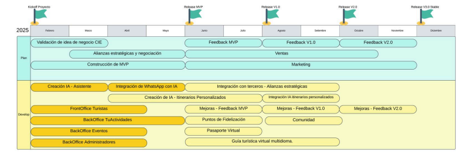

 
  

<h1 align="center" style="margin-top: 20px">Turuguay - Proyecto Hackaton iUruguay Turismo 2024</h1>

  <a href="https://juansemastrangelo.github.io/TUruguay---Hackaton-2024/" target="_blank">Demo</a> &#xa0; | &#xa0;
  <a href="https://www.figma.com/design/u8Ep96yN1wpcRni7KEvA4p/Untitled?node-id=0-1&t=gCRvIcIFK7jB74qE-1" target="_blank">Figma (UI-UX)</a> &#xa0; | &#xa0; 
  <a href="https://www.youtube.com/watch?v=xRY90m8JhUw" target="_blank">Presentación</a>&#xa0; | &#xa0; 
  <a href="#roadmap" target="_blank">Roadmap</a>&#xa0; | &#xa0; 
  <a href="./assets/iUruguay_Lanzamiento_V01.pdf" target="_blank">Sobre la hackathon</a>

 

<video src="./assets/TUruguayRender.mp4" width="80%" autoplay controls />

 

## 🏆 2do lugar ##

## :dart: Propuesta ##
Plataforma diseñada para conectar a turistas con
experiencias únicas en todo el país. Desde tours y actividades hasta eventos culturales y
naturales, todo está centralizado en un solo lugar.
Para hacer que la experiencia sea aún más accesible y práctica, desarrollamos como
complemento un chatbot inteligente de whatsapp, permitiendo a los usuarios interactuar de
manera rápida y sencilla sin tener que acceder a la plataforma web.
Además al usar una solución tan robusta como lo es whatsApp contamos con las siguientes
ventajas:
1. Whatsapp interfaz intuitiva y masiva.
2. Disponibilidad 24/7.
3. Información en tiempo real (basado en intereses del usuario o pronóstico del día).
4. Adaptabilidad de diferentes idiomas.
5. Reducción de costos operativos para la recopilación de datos.
6. Notificaciones.
Imagina recibir una notificación justo cuando las ballenas están cruzando las costas de
Rocha, o descubrir un festival de jazz en Atlántida el mismo día que ocurre.
En nuestra web, los turistas pueden explorar actividades por región, reservar tours con un
solo clic y descubrir las maravillas que Uruguay tiene para ofrecer. Desde paseos en
avioneta hasta festivales culturales, todo está organizado y al alcance del turista.

## :rocket: Roadmap ##

<ul>
  <li>
  Fase 1: Validación y Construcción del MVP (Febrero a Junio 2025)  
  Durante los primeros meses, nos enfocamos en validar la idea de negocio con aliados estratégicos y usuarios iniciales, mientras desarrollamos el núcleo del sistema, incluyendo el chatbot inteligente, el frontoffice para turistas y los distintos backOffices. Esto nos permite lanzar una versión rápidamente funcional que sea atractiva para los usuarios y recolectar feedback temprano.
  </li>  
  <li>
  Fase 2: Iteración y Escalamiento (Junio a Septiembre 2025)  
  Recogemos feedback del MVP, implementamos mejoras y expandimos las funcionalidades clave, como la creación de itinerarios personalizados, puntos de fidelización y pasaporte virtual (cada sello será un NFT -> Marketing) donde para mantener los turistas enganchados en la app y a su vez puedan ir compartiendo sus logros en las redes sociales. Al mismo tiempo, consolidamos alianzas estratégicas con distintos agentes para aumentar la oferta disponible en la plataforma.
  </li>  
  <li>
  Fase 3: Estabilidad y Expansión (Setiembre a Diciembre 2025)  
  Con el feedback de la versión 2.0, lanzamos la versión estable de TUruguay, incluyendo el pasaporte virtual y una guía turística multilingüe. Esta fase se centra en solidificar la experiencia del usuario y sentar las bases para un crecimiento sostenible a largo plazo.  
  Este roadmap no solo garantiza un desarrollo progresivo, sino que también prioriza el impacto inmediato para usuarios y socios estratégicos. Es un plan claro, realizable y con metas definidas que transformarán la experiencia turística en Uruguay.
  </li>
</ul>

[Datos Actualizados Turismo Receptivo en Uruguay](https://turismo.gub.uy/observatorio/turismoReceptivo.html)

